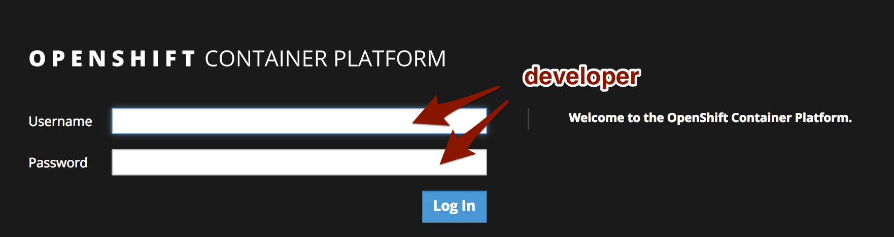
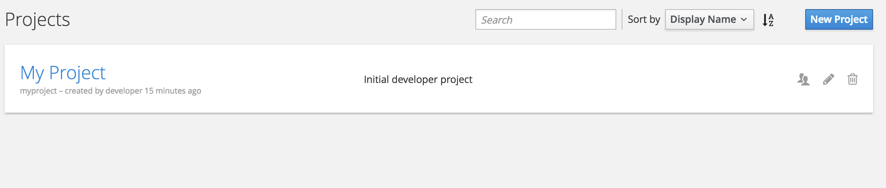
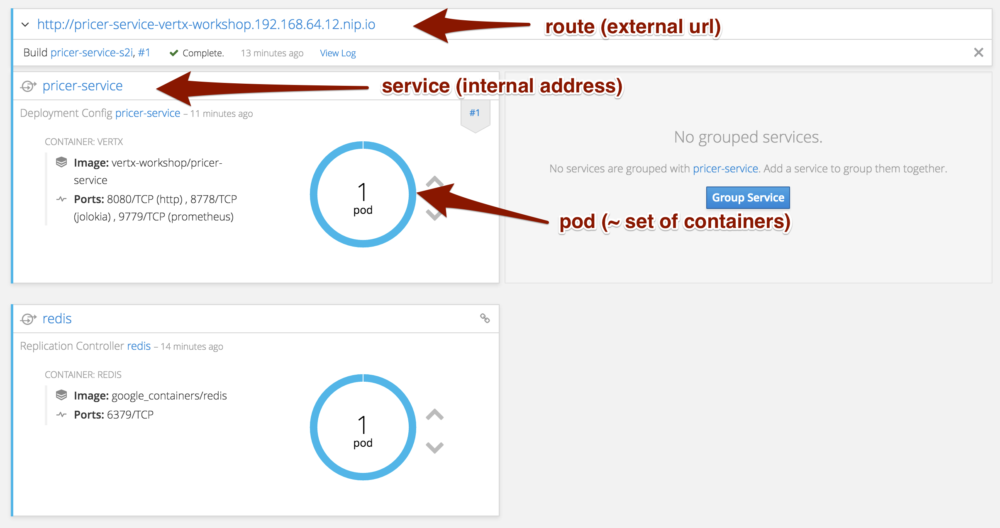

== Getting started

=== Prerequisites

* Java 8 JDK installed
* Apache Maven 3.3.9+
* You have downloaded / unpack the lab content into a directory (called `$WORKSHOP_DIR` in the rest of the lab) .

=== Connecting to OpenShift

You will be assigned an id. Your account is `user$id`, for example, if you receive the id `0`, you will be `user0`.

In your browser (Google Chrome recommended), open https://35.197.63.242:8443 (ignore the certificate issues), and connect with `user$id` / `user$id`. For instance, `user1` / `user1`.

Then, click on the question mark (top right), and in the drop down menu select _Command Line Tools_. Click on the _Latest Release_ link. Scroll to the bottom the page, and download the `openshift-origin-client-tools` for your operating system. Unzip the package and place the `oc` executable in the system `$PATH`.

Then, go back to the OpenShift console (https://console.vertx-javaday-workshop.35.197.63.242.nip.io:8443/console/command-line), and copy the `oc login` command line.

[source, bash]
----
# Copy and paste the oc login command
> oc login https://console.vertx-javaday-workshop.35.197.63.242.nip.io:8443 --token=xxxxxxxxxxxx
The server uses a certificate signed by an unknown authority.
You can bypass the certificate check, but any data you send to the server could be intercepted by others.
Use insecure connections? (y/n): y
....
> oc whoami
user1
----

Then, you should see the list of projects:

=== Creating a new project

We are going to use an already created project to run our different microservices. In the same terminal, navigate to `$WORKSHOP_DIR` and issue:

[source, bash]
----
oc project user$id # be sure to pass the right id
oc policy add-role-to-user view admin -n user$id
oc policy add-role-to-user view -n user$id -z default
oc policy add-role-to-group view system:serviceaccounts -n user$id
oc create -f scripts/templates/redis/redis.yaml
oc create -f scripts/templates/redis/redis-rc.yaml
oc create -f scripts/templates/redis/redis-service.yaml
cd pricer-service
mvn clean fabric8:deploy
----

The commands 2 to 4 are setting the permissions on the different resources. The commands 5 to 7 are deploying Redis (we are going to use Redis later). Finally, the 2 last commands build and deploys a microservice we are going to use later.

Once done, if you go back to the browser, and click on your project `user$id`. Click on it. You should see the different entities created:

=== What's next ?

We have an environment ready to host our microservice, but something is missing... our microservices. That's the next link:2-the-application.adoc[step].