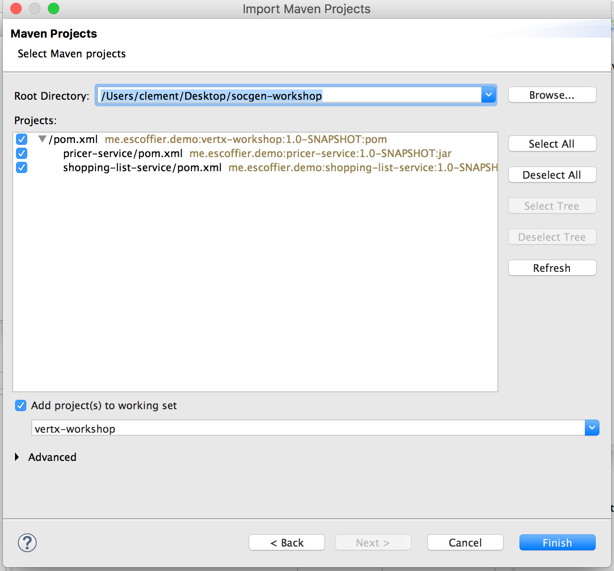
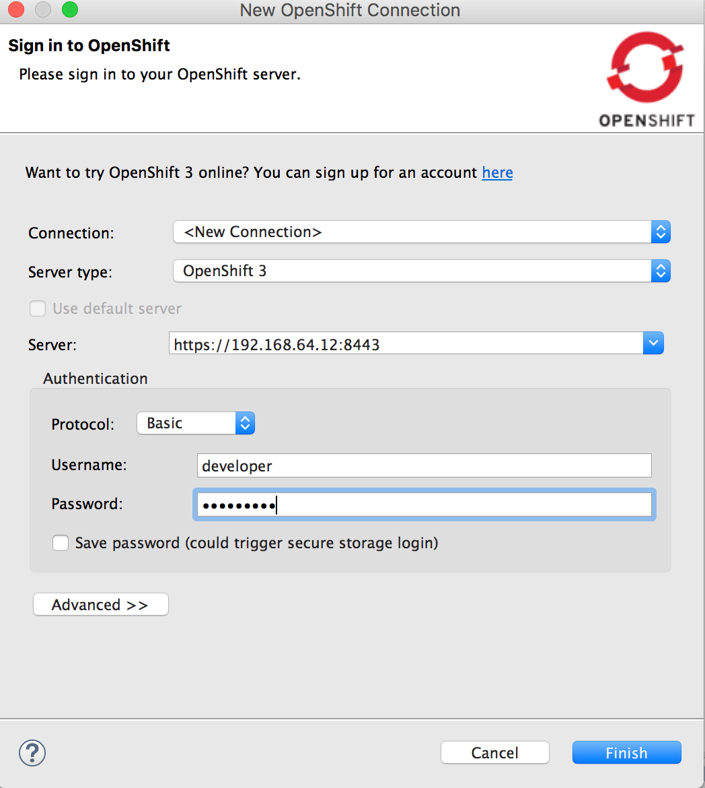
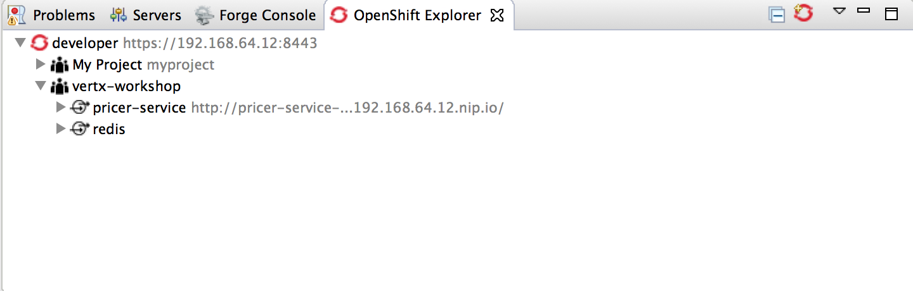

== The Shopping list application

We are going to build a set of microservices to handle a "shopping list". The application is composed by 3 microservices:

* the shopping backend
* the pricer service (already developed and deployed)
* the shopping list service retrieving the items from the shopping list backend and calling the pricer for each item.

The shopping backend exposes a HTTP endpoint (REST). The pricer-service also exposes a HTTP endpoint. The shopping list service invokes the two other services and expose the result on HTTP. These microservices are going to be reactive and developed with Vert.x

=== Vert.x

We will attempt to explain Vert.x in just a few lines. Remember that we said in the previous section that Vert.x is "a toolkit for building reactive applications on the JVM".

There are a three important points in this description: toolkit, reactive and "on the JVM".

Firstly, Vert.x is a toolkit. Meaning, Vert.x is not an application server, a container nor a framework. It’s not a JavaScript library either. Vert.x is a plain old jar file, so a Vert.x application is an application that uses this jar file. Vert.x does not define a packaging model, all Vert.x components are plain boring jar files. How does this impact you and your application? Let’s imagine you are using a build tool such as Maven or Gradle, to make your application a Vert.x application just add the vertx-core dependency. Wanna use another Vert.x components, just add it as a dependency. It’s simple, burden-less. Starting the application is a simple class with the public static void main(String[] args) entry point. No specific IDE or plugin to install to start using Vert.x.

Therefore, to use the awesomeness provided by Vert.x, you just need to use it in your code, but be patient, this will be covered later.

Secondly, Vert.x is reactive. It is specifically made to build reactive applications, or more appropriately, systems. Reactive systems has been defined in the Reactive Manifesto. Although, it’s not long document to read, we will further reduce it to these 4 bullet points:

* Responsive: a reactive system needs to handle requests in a reasonable time (I let you define reasonable).

* Resilient: a reactive system must stay responsive in the face of failures (crash, timeout, 500 errors…​), so it must be designed for failures and deal with them appropriately.

* Elastic: a reactive system must stay responsive under various loads. As a consequence, it must scale up and down, and be able to handle the load with minimal resources.

* Message driven: components from a reactive system interacts using asynchronous message-passing.

Also, Vert.x is event-driven and also non-blocking. Events are delivered in an event loop that must never be blocked. Let’s explain why. Unlike traditional, let’s say "enterprise", systems, Vert.x uses a very small number of threads. Some of these threads are event loops, they are responsible for dispatching the events in Handlers. If you block this thread, the events won’t be delivered anymore. This execution model impacts how you write your code, instead of the traditional blocking code, your code is going to be asynchronous and non-blocking.

As an example, if we wanted to retrieve a resource from a URL, we would do something like this:

[source, java]
----
URL site = new URL("http://vertx.io/");
BufferedReader in = new BufferedReader(new InputStreamReader(site.openStream()));

String inputLine;
while ((inputLine = in.readLine()) != null) {
  System.out.println(inputLine);
}
in.close();
----

But with Vert.x we are more likely to do:

[source,java]
----
vertx.createHttpClient().getNow(80, "vertx.io", "", response -> {
  response.bodyHandler(System.out::println);
});
----

The main differences between these 2 codes are:

* the first one is synchronous and potentially blocking : the instructions are executed in order, and may block the thread for a long time (because the web site may be slow or whatever).
* the Vert.x one is asynchronous and non-blocking: the thread (event loop) is released while the connection with the HTTP server is established and so can do something else. When the response has been received, the same event loop calls the callback. Most of the Vert.x components are single-threaded (accessed only by a single thread), so no concurrency burden anymore. By the way, with Vert.x, even the DNS resolution is asynchronous and non-blocking (while Java DNS resolution is blocking).

Finally, Vert.x applications runs "on the JVM" the Java Virtual Machine (8+). This means Vert.x applications can be developed using any language that runs on the JVM. Including Java(of course), Groovy, Ceylon, Ruby, JavaScript, Kotlin and Scala. We can even mix and match any combination of all these languages. The polyglot nature of Vert.x application allows you use the most appropriate language for the task.

Vert.x lets you implement distributed applications, either by using the built-in TCP and HTTP server and client, but also using the Vert.x event bus, a lightweight mechanism to send and receive messages. 

Wao!, that’s a lot of information to process... However, you might still want to ask: What kind of applications can I use Vert.x for? We say, Vert.x is incredibly flexible - whether it’s simple network utilities, sophisticated modern web applications, HTTP/REST microservices, high volume event processing or a full blown backend message-bus application, Vert.x is a great fit. It’s fast, and does not constraint you. Last but not least, Vert.x provides appropriate tools to build reactive systems; systems that are: responsive, elastic, resilient and asynchronous!

=== Demystifying microservices
Except you spent the last year in a cave, you probably have heard about microservices. So what are microservices? To answer this questions, let’s quote from a veteran:

[quote, Martin Fowler]
----
The microservice architectural style is an approach to developing a single application as a suite of small services, each running in its own process and communicating with lightweight mechanisms, often an HTTP resource API. These services are built around business capabilities and independently deployable by fully automated deployment machinery. There is a bare minimum of centralized management of these services, which may be written in different programming languages and use different data storage technologies.
----
(from http://martinfowler.com/articles/microservices.html)

Microservice is an architectural style, which means it is a specialization of element and relation types, together with constraints and how they can be used. I believe by now, I have left you more confused than you before we started.

Not to worry. Let’s take another approach. Why do we need microservices? In one word: agility. Let’s imagine, we have an application, rather large. As a large application, the maintenance is a nightmare, adding features take too much time, the technology used is very outdated (What? Corba is not cool anymore?), any change needs to pass a 50-steps process and be validated by 5 levels of management. Obviously there are several teams on the application with different requirements and agendas. Well, we have such a monster app. How could we make the development and maintenance of this application efficient? Microservices are one answer to this question. It aims to reduce the time to production.

To do that end, the microservice architectural style proposes to:

* split the application into a set of decoupled components providing defined services (defined means with a known interface or API)
* allow the components communicate with whatever protocol the choose, often REST, but not necessarily
* allow the components use whatever languages and technologies they want
* allow each component be developed, released and deployed independently
* allow the deployments be automated in their own pipeline
* allow the orchestration of the whole application be reduced to the barest minimum

Point 6 is interesting, and often misunderstood. It’s pretty cool to develop independent pieces of software that magically interact at runtime. Yes, I said magically but in technology we don’t believe in magic. To make this happen, what we need is some form of service discovery at runtime. The service discovery mechanism can achieve it’s goal with any number of suitable means. These range from: hard-coding the service location in the code (which is generally a bad idea), using a DNS lookup service, or some more advanced techniques.

Having a service discovery mechanism allows our system components interact transparently amongst each other regardless of location or environment. It also allows us to easily load-balance amongst our components through a round robin algorithm, for example, thereby making our system more fault-tolerant (by locating another service provider when one breaks down).

Although by definition, microservice applications are not required to be distributed, there usually are in practice. This comes with all the distributed application benefits and constraints: consensus computation (FLP), CAP theorem, consistency, monitoring, and many other reasons to fail. So microservices applications need to be designed to accommodate failures from their early implementation stage.

Before we go further, there are a couple of points I would like to mention. Microservices are not new and the concept is not rocket science. Academic papers from the 70’s and 80’s have defined (using different words) architectural styles very close to this. Also very important point to understand is: microservices are not a silver bullet. (Unless well managed) it has the capacity to increase the complexity of your application due to its distributed nature. Lastly, a microservice architecture will not fix all your issues.

The major concerns when it comes microservices are rapid delivery, adaptation, independence and replaceability. Every microservice is made to be replaceable by another providing the same service / API / interface (at the core, it’s basically an application of the Liskov substitution principle).

If you have been a developer for about 10 years, you might want to ask what difference is between microservices and SOA. For a lot of people it’s about size. This is not always true because services don’t necessarily have to be small which makes the term "microservice" quite misleading. Microservices and SOA differ purpose but the basic concepts are similar:

service : a defined feature accessible by an API, a client, a proxy, anything

* service provider: a component implementing a service
* service consumer: a component consuming a service
* service discovery: the mechanism used by a consumer to find a provider

Both approaches inherit from the service oriented computing, aiming to decompose and manage independent pieces of software. You may have never heard about this even if you used it: COM, Corba, Jini, OSGi, and web services are all different implementations of service oriented computing.

Finally, there is a common misconception that microservices must be RESTful by nature. This can’t be farther from the truth. Microservices can employ any number interaction style that best fit their purpose: RPC, events, messages, streams etc. In this lab we will using RESTful services, async RPC, and message sources.

Ok, enough talking for now, we need a bit of action.

=== Import the source code in the IDE

Before starting developing, let's prepare the IDE. Open the JBoss developer studio. Configure the workspace wherever you want. 

Then, import the projects using: `File -> Import`, select `Maven/Existing Maven Projects`. With the `browse` button, navigate to the workshop file root, and click on the `finish` button:

=== Connect to OpenShift

We can connect the IDE with OpenShift. First, click on the `OpenShift Explorer` tab. Then, click on the `New Connection Wizard...` link. In the wizard, enter the following details:

The password is `developer`.

Then click on `Finish`. You need to accept the certificate. 

Once the connection is established, you can see the different entities created in OpenShift directly from your IDE:

=== What's next ?

We are now ready to develop our first microservice, the shopping backend. Follow me, it's link:./3-the-shopping-backend.adoc[there].

