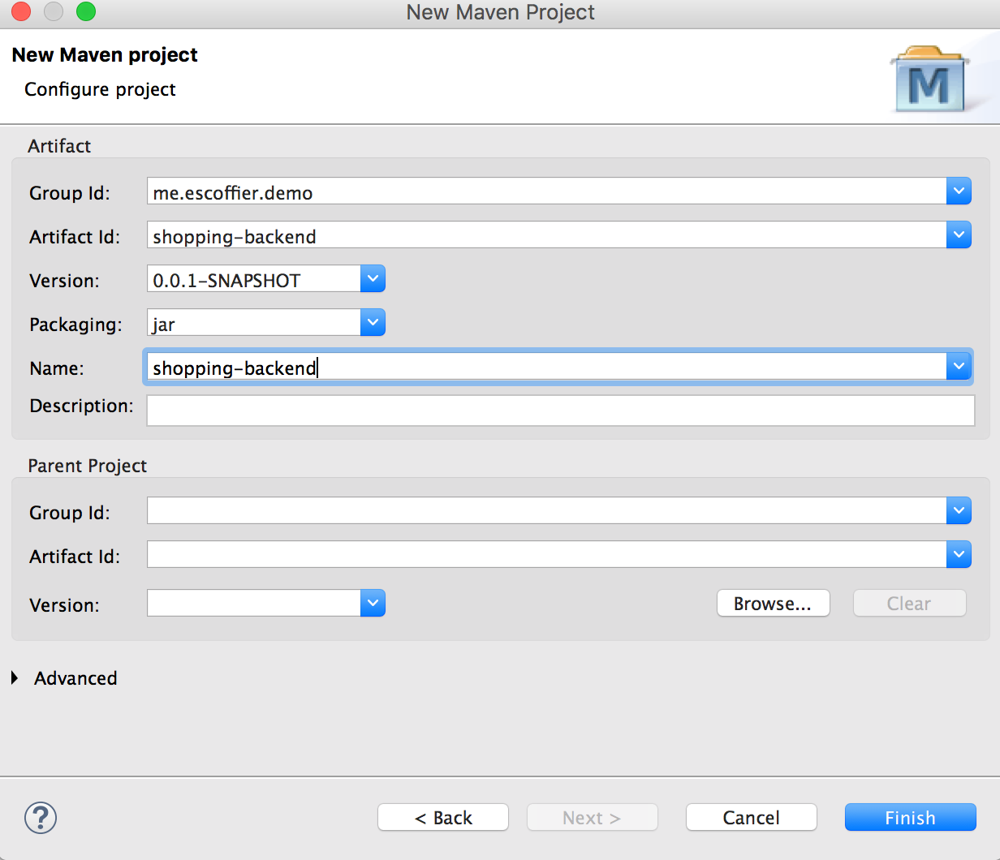
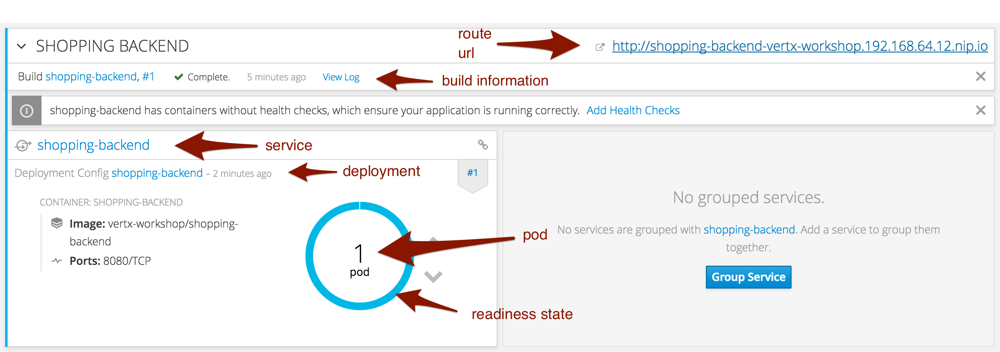

== The Shopping backend microservice

The shopping backend is a very simple microservice providing a shopping list manager. It supports getting the list items, adding an item and removing an item. But before developing this, let's start with some Vert.x basics.

=== Creating a project for our microservice

In your IDE, create a new Maven project / module. When asked, enter the following details:

* Group Id: `me.escoffier.demo` (or whatever you want)
* Artefact Id: `shopping-backend` (must be exactly this)
* Name: Optional, if set must be `shopping-backend`

In Eclipse, it should be:

The `shopping-backend` project is now created. Let's open the `pom.xml` file. Double click on it to open it, and then select the `pom.xml` tab (last tab) to see the XML.

[source, xml]
----
<project xmlns="http://maven.apache.org/POM/4.0.0" xmlns:xsi="http://www.w3.org/2001/XMLSchema-instance" xsi:schemaLocation="http://maven.apache.org/POM/4.0.0 http://maven.apache.org/xsd/maven-4.0.0.xsd">
  <modelVersion>4.0.0</modelVersion>
  <groupId>me.escoffier.demo</groupId>
  <artifactId>shopping-backend</artifactId>
  <version>0.0.1-SNAPSHOT</version>
  <name>shopping-backend</name>
</project>
----

In a terminal, navigate to the created directory and execute:

[source]
----
mvn io.fabric8:vertx-maven-plugin:1.0.13:setup -Ddependencies=redis,web,service-discovery,service-discovery-kubernetes,org.slf4j:slf4j-api:1.7.25
----

This command adds the Vert.x Maven Plugin to the `pom.xml` file and declares a couple of dependencies (required by our microservice).

Once the form is filled, click on `Run`.

The `pom.xml` file has been updated with lots of new content:

[source, xml]
----
<?xml version="1.0"?>
<project xsi:schemaLocation="http://maven.apache.org/POM/4.0.0 http://maven.apache.org/xsd/maven-4.0.0.xsd" xmlns="http://maven.apache.org/POM/4.0.0"
    xmlns:xsi="http://www.w3.org/2001/XMLSchema-instance">
  <modelVersion>4.0.0</modelVersion>
  <groupId>me.escoffier.demo</groupId>
  <artifactId>shopping-backend</artifactId>
  <version>0.0.1-SNAPSHOT</version>
  <name>shopping-backend</name>
  <properties>
    <vertx.projectVersion>3.4.2</vertx.projectVersion>
    <fabric8-vertx-maven-plugin.projectVersion>1.0.13</fabric8-vertx-maven-plugin.projectVersion>
  </properties>
  <dependencyManagement>
    <dependencies>
      <dependency>
        <groupId>io.vertx</groupId>
        <artifactId>vertx-dependencies</artifactId>
        <version>${vertx.projectVersion}</version>
        <type>pom</type>
        <scope>import</scope>
      </dependency>
    </dependencies>
  </dependencyManagement>
  <dependencies>
    <dependency>
      <groupId>io.vertx</groupId>
      <artifactId>vertx-core</artifactId>
    </dependency>
    <dependency>
      <groupId>io.vertx</groupId>
      <artifactId>vertx-redis-client</artifactId>
    </dependency>
    <dependency>
      <groupId>io.vertx</groupId>
      <artifactId>vertx-web</artifactId>
    </dependency>
    <dependency>
      <groupId>io.vertx</groupId>
      <artifactId>vertx-service-discovery</artifactId>
    </dependency>
    <dependency>
      <groupId>io.vertx</groupId>
      <artifactId>vertx-service-discovery-bridge-kubernetes</artifactId>
    </dependency>
    <dependency>
      <groupId>org.slf4j</groupId>
      <artifactId>slf4j-api</artifactId>
      <version>1.7.25</version>
    </dependency>
  </dependencies>
  <build>
    <plugins>
      <plugin>
        <groupId>io.fabric8</groupId>
        <artifactId>vertx-maven-plugin</artifactId>
        <version>${fabric8-vertx-maven-plugin.projectVersion}</version>
        <executions>
          <execution>
            <id>vmp-init-package</id>
            <goals>
              <goal>initialize</goal>
              <goal>package</goal>
            </goals>
          </execution>
        </executions>
        <configuration>
          <redeploy>true</redeploy>
        </configuration>
      </plugin>
    </plugins>
  </build>
</project>
----

Go back to the `pom.xml` file editor, and in the `properties` add the following lines:

[source, xml]
----
<properties>
    <vertx.projectVersion>3.4.2</vertx.projectVersion>
    <fabric8-vertx-maven-plugin.projectVersion>1.0.13</fabric8-vertx-maven-plugin.projectVersion>
    <!-- to add: -->
    <vertx.verticle>me.escoffier.demo.ShoppingBackendVerticle</vertx.verticle>
    <maven.compiler.source>1.8</maven.compiler.source>
    <maven.compiler.target>1.8</maven.compiler.target>
</properties>
----

The `vertx.verticle` property declares the endpoint of our application. A verticle is a Vert.x component, and it just instructs Vert.x to deploy it. The two other lines are configuring the Java version.

**Optional:** You can update the Vert.x Project version to 3.5.0.

=== Implement our first verticle

We have declared a verticle, but we need to implement it now. Create a new class named `me.escoffier.demo.ShoppingBackendVerticle` as name. In the Java code add an extension clause on `AbstractVerticle` to obtain:

[source, java]
----
package me.escoffier.demo;

import io.vertx.core.AbstractVerticle;

public class ShoppingBackendVerticle extends AbstractVerticle {

}
----

Great, it does ... nothing, but it's a start. Add the `start` method as follows:

[source, java]
----
@Override
public void start() {
    vertx.createHttpServer()
      .requestHandler(req -> req.response().end("Hello"))
      .listen(8080);
}
----

The `start` method is called when the verticle is deployed. In the method, we create an HTTP server. On each request it writes "Hello" in the response. We start the server on the port 8080. Notice the _reactive_ style. On every request, the handler is called. The handler does not return a response but write into it using a non-blocking manner.

The IDE may not like the lambda expression we used. Click on the error and select `Change project compliance and JRE to 1.8`.

=== Run our application

It's time to see what this does. In your terminal, in the module directory ($WOKSHOP_DIR/shopping-backend), run:

[source, bash]
----
mvn compile vertx:run
----

This command tracks source code changes and redeploys the application when needed.

So, now that the application is running, open a browser to http://localhost:8080, and you should see `hello`.

Let's now update the _request handler to be:

[source, java]
----
  @Override
	public void start() {
		vertx.createHttpServer()
		.requestHandler(req -> req.response().end("Hello from " + Thread.currentThread().getName()))
		.listen(8080);
	}
----

Save the file. You can see the Maven redeploy in action. Refresh the browser. You should see: `Hello from vert.x-eventloop-thread-0`. Try to refresh it several times. It's always the same thread that is used. This is one of the core characteristics of Vert.x: verticles are single-threaded so you don't have to worry about state, field access... But don't forget, you must never block, because if you block the thread, the other request cannot be processed until the thread is released.

== Develop a REST API

Well, great, but we mentioned earlier we wanted a REST API to manage a shopping list. Something like:

* `GET /shopping` -> Get a JSON representation of the list
* `POST /shopping` -> Add a new item (JSON passed in the body of the request) to the list
* `DELETE /shopping/:name` -> Remove an item from the list

Implementing this _routing_ in the request handler is going to be tedious. Fortunately, Vert.x has a component named Vert.x Web to handle such kind of task. Replace the content of the class file with:

[source, java]
----
package me.escoffier.demo;

import java.util.HashMap;
import java.util.Map;

import io.vertx.core.AbstractVerticle;
import io.vertx.core.json.Json;
import io.vertx.core.json.JsonObject;
import io.vertx.ext.web.Router;
import io.vertx.ext.web.RoutingContext;
import io.vertx.ext.web.handler.BodyHandler;

public class ShoppingBackendVerticle extends AbstractVerticle {

	/**
	 * The shopping list. The key is the product name, the value the quantity.
	 */
	private Map<String, Integer> list = new HashMap<>();
	
	@Override
	public void start() {
		// The router dispatches the incoming HTTP request to the "right" route:
		Router router = Router.router(vertx);
		
		// We need to declare our routes:
		// First route, the same as before
		router.get("/").handler(rc -> rc.response().end("Hello"));
		
		// This is the route serving the list as JSON
		router.get("/shopping").handler(this::getList);
		
		// The POST route need to read the body of the request. We instructs Vert.x to 
		// parse it
		router.route().handler(BodyHandler.create());
		router.post("/shopping").handler(this::addToList);
		
		// Finally, the DELETE route get the product to delete as a path parameter ("name")
		router.delete("/shopping/:name").handler(this::deleteFromList);
					
		vertx.createHttpServer()
		  // We pass the router accept method as request handler.
		  .requestHandler(router::accept)
		  .listen(8080);
	}
	
	private void getList(RoutingContext rc) {
		// We write the JSON representation of the list as response
		rc.response().end(Json.encode(list));
	}
	
	private void addToList(RoutingContext rc) {
		// Retrieve the body as json
		JsonObject json = rc.getBodyAsJson();
		// Get the item details
		String name = json.getString("name");
		Integer quantity = json.getInteger("quantity", 1);
		
		list.put(name, quantity);
		// Return the updated list
		getList(rc);
	}
	
	private void deleteFromList(RoutingContext rc) {
		String name = rc.pathParam("name");
		// Remove the name from list
		list.remove(name);
		// Return the updated list
		getList(rc);
	}
		
}
----

Now, open your browser to: http://localhost:8080/shopping. You should see `{}`. To add items, either use a REST client (in Chrome you can use the Advanced REST client, or Curl), or run the given client adding 3 items to the list. From the workshop directory (`$WORKSHOP_DIR`) run (in a terminal):

[source, bash]
----
# Retrieve the shopping list
java -jar shopping-backend-client/bin/shopping-backend-client.jar -u http://localhost:8080

# Add an item to the shopping list
java -jar shopping-backend-client/bin/shopping-backend-client.jar -u http://localhost:8080 -a add -p bread
java -jar shopping-backend-client/bin/shopping-backend-client.jar -u http://localhost:8080 -a add -p croissant -q 2

# Populate the list with three items
java -jar shopping-backend-client/bin/shopping-backend-client.jar -u http://localhost:8080 -a populate

# Remove an item from the list
java -jar shopping-backend-client/bin/shopping-backend-client.jar -u http://localhost:8080 -a remove -p croissant
----

=== Deploying the microservice to OpenShift

So we do have our first microservice, it's time to deploy it to OpenShift. OpenShift is a container platform, our application is going to run inside a container. Actually, OpenShift is a distribution of Kubernetes (https://kubernetes.io). It manages the deployment and orchestration of the different containers composing your system.

image:images/openshift-architecture.png[]

OpenShift also manages building your containers and updates. We won't build the containers on our machine, but delegate this task to OpenShift. Every time we push a new version, OpenShift is going to update the running version. 

To deploy an application to OpenShift, there are several entities to create. It can be quite confusing. Let's try to understand the process:

image:images/openshift-entities.png[]

First you have source code. We create a _build_ configuration on OpenShift. So, when we send the source code to OpenShift, it knows what needs to be done, and produces a container image. This image is pushed into the OpenShift registry. Then, we create a _deployment_ configuration instructing OpenShift about how to get our application running. In most case it just creates a _pod_ (a group of container, generally a single one) with our application.

But that's not enough. Our application is running but we need to access it. For this, we create a _service_. It's an internal _virtual_ address exposing the endpoint offered by our application to the other applications running in OpenShift. _Services_ delegate requests to a set of pods using a round-robin strategy. But, we want to access the service from outside. For this, we need a _route_, delegating request on a public URL to a _service_. 

OpenShift proposes several strategies to deploy application. For the `shopping-backend` microservice, we are going to use the _manual_ way.

Ok, let's start. The first things to do is to create a `Dockerfile` in the `shopping-backend` directory:

[source]
----
FROM openjdk:8-jre-alpine
EXPOSE 8080
COPY target/*.jar /vertx/
WORKDIR /vertx
CMD java -jar *.jar -Dvertx.cacheDirBase=/tmp
----

Stop the application if it's still running (CTRL+C to exit). Then in the terminal, run: `mvn clean package`.
Then execute:

[source, bash]
----
# Create a build configuration of type binary
oc new-build --binary --name=shopping-backend -l app=shopping-backend
# Trigger the build - It sends the directory content to OpenShift
# OpenShift detects the Dockerfile and build the image
oc start-build shopping-backend --from-dir=. --follow
# Create a new application - it creates a deployment config with a service and 1 pod
oc new-app shopping-backend -l app=shopping-backend
# Create the route exposing the service
oc expose service shopping-backend
----

When everything completes, go to the OpenShift console. You should see:

Click on the route url. You should see `hello`. Append `/shopping` to get the (empty) shopping list. Copy the route url (the page url without `/shopping`). In another terminal, navigate to the `$WORKSHOP_DIR` directory,  and use the shopping list client to add items:

[source, bash]
----
# Substitute $id in the route url
java -jar shopping-backend-client/bin/shopping-backend-client.jar -u http://shopping-backend-user$id.apps.vertx-javaday-workshop.35.197.63.242.nip.io/shopping -a populate
----

(Replace the url used above with the route url)

Now refresh the page in the browser to see the shopping list. Yahoo! We did it. First microservice running in OpenShift.

=== Going further

That was just the first step, let's improve a bit our link:4-replicas-and-redis.adoc[microservice].
