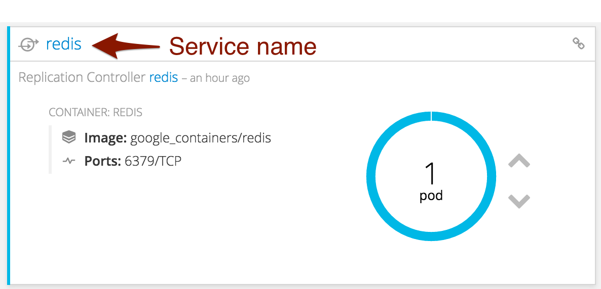
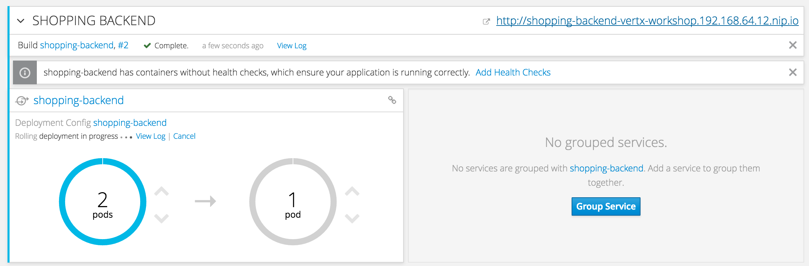
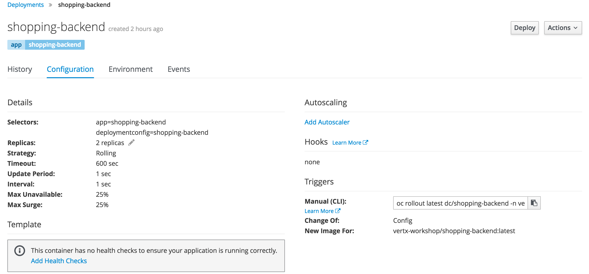
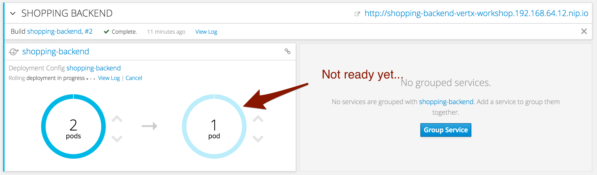

## Playing with replicas and the split shopping list issue

It's great to have deployed our microservice on OpenShift, but if you are using a Cloud platform, there is a good chance it's for scalability reason. In this chapter we are going to improve our microservice with:

* running several replicas
* using a shared data store
* zero-downtime updates

=== Scale up !

Let's create two replicas of our application. In a terminal, run:

[source,bash]
----
oc scale dc shopping-backend --replicas=2
----

Alternatively, you can use the arrows in the OpenShift console (on the right side of the pod).

Once you have 2 replicas, OpenShift implements a round-robin to dispatch the requests. This is managed by the OpenShift _service_.

If you refresh the page in your browser, you should still see the different items we added into the list. So, is this working.... 

=== Oh no, the split shopping list syndrome !

With the shopping backend client run several times:

[source, bash]
----
java -jar shopping-backend-client/bin/shopping-backend-client.jar -u http://shopping-backend-vertx-workshop.192.168.64.12.nip.io
----

Every second requests, the shopping list is empty. This is because we keep the list in memory, and only on pod has it. We need to use a common data store to store the list, so all instances can access it.

But why it's still working in the browser. It's because of `keep-alive`. OpenShift implements a connection affinity. Until the connection is closed, it uses the same pod. In the command line version, the connection is closed between calls.

=== Service discovery

Ok, so let's use a shared data store, but I'm on the Cloud. How do I locate it? It's where Vert.x service discovery and Kubernetes / OpenShift integration helps. When deployed on top of Kubernetes / OpenShift, the Vert.x service discovery can retrieve the services directly. In our case, we deployed a Redis database named `redis`:

We are going to use this "name" to retrieve the Redis database instance, without knowing its exact IP address and port.

=== Replacing the in-memory list with Redis

(the full code is given below)

Open the `ShoppingBackendVerticle` class. The first thing to do is to replace the `list` member with a `RedisClient`:

[source, java]
----
/**
 * The client to access Redis.
 */
private RedisClient redis;
----

Redis is a key-value data store. Let's use it in a very simple way and store the shopping list to a specific key. To make the code a bit more elegant, we declare the name of the key as constant:

[source, java]
----
/**
 * The key
 */
private static final String KEY = "SHOPPING";
----

=== Using service discovery to retrieve the Redis instance

Replace the `start` method with:

[code, java]
----
    @Override
	public void start() {
		// The router dispatches the incoming HTTP request to the "right" route:
		Router router = Router.router(vertx);
		
		// We need to declare our routes:
		// First route, the same as before
		router.get("/").handler(rc -> rc.response().end("Hello"));
		
		// This is the route serving the list as JSON
		router.get("/shopping").handler(this::getList);
		
		// The POST route need to read the body of the request. We instructs Vert.x to 
		// parse it
		router.route().handler(BodyHandler.create());
		router.post("/shopping").handler(this::addToList);
		
		// Finally, the DELETE route get the product to delete as a path parameter ("name")
		router.delete("/shopping/:name").handler(this::deleteFromList);
					
		// Create a new instance of Vert.x service discovery
		// When ready, lookup for the Redis data source using the name
		// When the service is retrieved, start the HTTP server.
		ServiceDiscovery.create(vertx, discovery -> {
			RedisDataSource.getRedisClient(discovery, svc -> svc.getName().equals("redis"), ar -> {
				redis = ar.result();
				vertx.createHttpServer()
					// We pass the router accept method as request handler.
					.requestHandler(router::accept)
					.listen(8080);					
			});
		});		
	}
----

Only the last part of the method has been changed. Now we get a Vert.x service discovery and retrieve the Redis client from it. We use a filter to select the service. To keep things simple, we just use the service name, but we could have used other metadata.

We can assigned the `redis` member from the callback because Vert.x is single-threaded, no risk for the state integrity. But the code is still not compiling, time to fix this!

=== Using the redis client

Replace the three handler methods with:

[source, java]
----
    private void getList(RoutingContext rc) {
		redis.hgetall(KEY, ar -> {
			if (ar.failed()) {
				// Something bad happened.
				// write a 500 response
				rc.fail(ar.cause());
			} else {
				rc.response().end(ar.result().encode());
			}
		});
	}
	
	private void addToList(RoutingContext rc) {
		// Retrieve the body as json
		JsonObject json = rc.getBodyAsJson();
		// Get the item details
		String name = json.getString("name");
		Integer quantity = json.getInteger("quantity", 1);
		
		redis.hset(KEY, name, quantity.toString(), x -> {
            // when done, return the updated list
			getList(rc);		
		});		
	}
	
	private void deleteFromList(RoutingContext rc) {
		String name = rc.pathParam("name");
		// Remove the name from list
		redis.hdel(KEY, name, x -> {
			// when done, return the updated list
			getList(rc);
		});		
	}
----

Instead of retrieving / updating the list, we now use the Redis client. We store the list in a _hash_ (a Json object), and update / read it accordingly. More details about the Vert.x Redis client and its API link:http://vertx.io/docs/vertx-redis-client/java/[here].

=== Full code

Our `ShoppingBackendVerticle` class is now:

[source, java]
----
package me.escoffier.demo;

import io.vertx.core.AbstractVerticle;
import io.vertx.core.json.JsonObject;
import io.vertx.ext.web.Router;
import io.vertx.ext.web.RoutingContext;
import io.vertx.ext.web.handler.BodyHandler;
import io.vertx.redis.RedisClient;
import io.vertx.servicediscovery.types.RedisDataSource;
import io.vertx.servicediscovery.ServiceDiscovery;

public class ShoppingBackendVerticle extends AbstractVerticle {

	/**
	 * The client to access Redis.
	 */
	private RedisClient redis;
	
	/**
	 * The key
	 */
	private static final String KEY = "SHOPPING";
	
	@Override
	public void start() {
		// The router dispatches the incoming HTTP request to the "right" route:
		Router router = Router.router(vertx);
		
		// We need to declare our routes:
		// First route, the same as before
		router.get("/").handler(rc -> rc.response().end("Hello"));
		
		// This is the route serving the list as JSON
		router.get("/shopping").handler(this::getList);
		
		// The POST route need to read the body of the request. We instructs Vert.x to 
		// parse it
		router.route().handler(BodyHandler.create());
		router.post("/shopping").handler(this::addToList);
		
		// Finally, the DELETE route get the product to delete as a path parameter ("name")
		router.delete("/shopping/:name").handler(this::deleteFromList);
					
		// Create a new instance of Vert.x service discovery
		// When ready, lookup for the Redis data source using the name
		// When the service is retrieved, start the HTTP server.
		ServiceDiscovery.create(vertx, discovery -> {
			RedisDataSource.getRedisClient(discovery, svc -> svc.getName().equals("redis"), ar -> {
				redis = ar.result();
				vertx.createHttpServer()
					// We pass the router accept method as request handler.
					.requestHandler(router::accept)
					.listen(8080);					
			});
		});		
	}
	
	private void getList(RoutingContext rc) {
		redis.hgetall(KEY, ar -> {
			if (ar.failed()) {
				// Something bad happened.
				// write a 500 response
				rc.fail(ar.cause());
			} else {
				rc.response().end(ar.result().encode());
			}
		});
	}
	
	private void addToList(RoutingContext rc) {
		// Retrieve the body as json
		JsonObject json = rc.getBodyAsJson();
		// Get the item details
		String name = json.getString("name");
		Integer quantity = json.getInteger("quantity", 1);
		
		redis.hset(KEY, name, quantity.toString(), x -> {
			// when done, return the updated list
			getList(rc);
		});		
	}
	
	private void deleteFromList(RoutingContext rc) {
		String name = rc.pathParam("name");
		// Remove the name from list
		redis.hdel(KEY, name, x -> {
			// when done, return the updated list
			getList(rc);
		});		
	}	
}
----

=== Rolling updates

So let's see this code in action. In your terminal, navigate to the `shopping-backend` project and issue:

[code, bash]
----
mvn clean package
oc start-build shopping-backend --from-dir=. --follow
----

We just rebuild the application and re-trigger the build on OpenShift. Go to the OpenShift console, and look at what's happening:

It's a rolling update. Instead of stopping the application, and starting the new version, OpenShift starts the first pod of the new version and when it thinks it's ready, scales down the first version to 1 pod, starts the second pod of the new version, and terminate the last version pod. This is pretty cool, because it should not involved downtime....

"Should", yes. As written, it shutdown the pods from the first version when OpenShift _thinks_ the new version is ready... But to think _well_, it needs a bit of help.

=== Health checks

We can help OpenShift to detect when the application is ready and alive with health checks. They are several ways to create health checks, but here, let's use the OpenShift UI.

In the OpenShift console, click on `Applications` -> `Deployments`, and click on `Shopping-Backend`. Then select the `Configuration` tab and click on `Add Health Checks`:

On the next page, click on `Add Readiness Probe` and `Add Liveness Probe`. Readiness probes are used during the rolling updates to determine when the application is actually ready. Liveness probes are a resilience mechanism to detect when the application has crashed. OpenShift automatically restart it.

Then, click on `Save`.

Go back to the `Overview` and look at the rolling update. You can notice a new color (light blue). It indicates that the pod is not ready yet.

When it becomes ready (dark blue), OpenShift shutdown the pods from the previous version - this time we have 0 downtime!

=== Wait, we didn't check the split shopping list syndrome fix

And you are right, let's do it right now!

With your browser if you open the shopping list, it's empty. Of course, we didn't add any item. With the shopping list backend client, add items to the list as:

[source, bash]
----
java -jar shopping-backend-client/bin/shopping-backend-client.jar -u http://shopping-backend-vertx-workshop.192.168.64.12.nip.io -a populate
----

Then, retrieve the list several times with:

[source, bash]
----
java -jar shopping-backend-client/bin/shopping-backend-client.jar -u http://shopping-backend-vertx-workshop.192.168.64.12.nip.io
----

And it should be fixed! Every request get the items from the list. We fixed it! Woohoo!

=== Going further

So our first microservice is now ready. It's time to build another one, consuming the `shopping-backend`. Follow me, it's happening link:./5-shopping-list-service.adoc[here].
