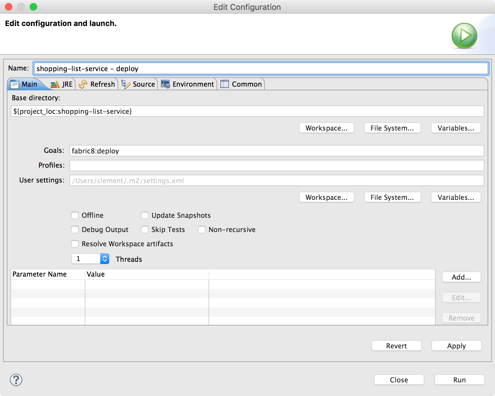
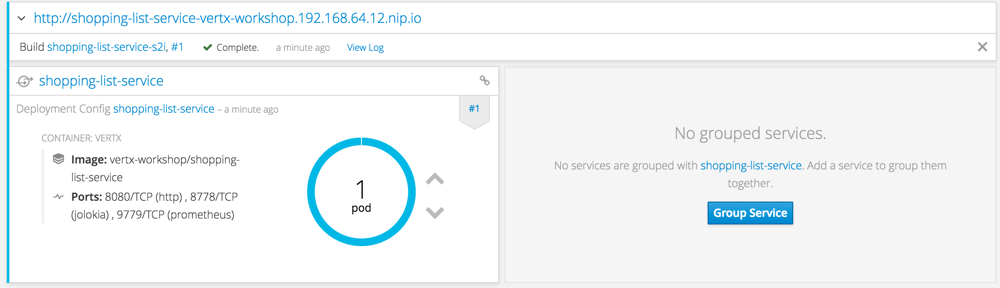

== The shopping list service

We have completed our first microservice, no time for rest, we need a second one. This microservice depends on the `shopping-backend` service and another service already up and running (the `pricer-service`). This second microservice, named `shopping-list-service` retrieved the shopping list from the `shopping-backend`, and for each item calls the `pricer-service`. All these interactions are asynchronous, and we would need to compose them.

=== Another microservice, another style

In the first microservice, we used the `callback`-style Vert.x API. Callbacks are the first form of asynchronous APIs, but quickly lead to code difficult to read. To implement this second microservice we are going to use RX Java (version 1.x). RX Java is an implementation of Reactive eXtension (http://reactivex.io/) - an initiative from Microsoft to _compose asynchronous and event-based programs by using observable sequences_.

RX lets you tame the asynchronous beast without callbacks. Asynchronous interactions are represented as data stream, and as soon as a new item is emitted in one of these streams, you are notified and can transform / filter / compose / merge it. The result of these operations is another data streams.

RX is lazy. All intermediate operations on streams only happen if there is a terminal _subscription_. 

Looks complex, don't worry we are going to see it in action.

=== Another microservice, another build strategy

In the first microservice, we used a `Dockerfile` to build our application image. We also had to create a set of OpenShift entities. In this microservice, we are using another strategy: S2I. S2I stands for _source to image_. Generally speaking, S2I build takes the source code of the application, builds it and packages it on OpenShift. However, for Java development, while it's possible, it can be slow. Building a Java application with Maven or Gradle has the unfortunate trend to download Internet every single build. To avoid this, we are using a S2I with binary content. Instead of the source code, it takes the application jar as input and builds an image with it using _production_ settings (configuration and command to start the application).

In addition, for this microservice, all these tasks are automated using the fabric8 Maven Plugin (https://maven.fabric8.io/). So to build and deploy the application, a simple `mvn fabric8:deploy` and you're done!

The fabric8 maven plugin and Vert.x are close friends. So it does not only generate the right image for your application, it can also create the health check procedures. 

=== Vert.x RX APIs

Time to see some code. Open the `shopping-list-service` project and look at the `me.escoffier.demo.MyShoppingList` class. First look at the import statements and notice the `rxjava` packages:

[source, java]
----
import io.vertx.circuitbreaker.CircuitBreakerOptions;
import io.vertx.core.json.JsonObject;
import io.vertx.rxjava.circuitbreaker.CircuitBreaker;
import io.vertx.rxjava.core.AbstractVerticle;
import io.vertx.rxjava.core.http.HttpServerResponse;
import io.vertx.rxjava.ext.web.Router;
import io.vertx.rxjava.ext.web.RoutingContext;
import io.vertx.rxjava.ext.web.client.HttpResponse;
import io.vertx.rxjava.ext.web.client.WebClient;
import io.vertx.rxjava.servicediscovery.ServiceDiscovery;
import io.vertx.rxjava.servicediscovery.types.HttpEndpoint;
import rx.Observable;
import rx.Single;
----

In this microservice we are using the Vert.x RX API. These packages contains classes with method prefixed with `rx` to indicate they return Reactive eXtension types (`Observable` or `Single`).

It's time to write some code to see how it looks like

=== Retrieving two services - Joining asynchronous operations

In the previous microservice we used the Vert.x service discovery to retrieve the Redis data store. In this microservice, we use the service discovery to retrieve two HTTP endpoints: the `shopping-backend` and the `pricer-service`. 

Retrieving services are asynchronous operations. We are going to do both at the same time and start the HTTP server when both services have been retrieved.

After the route declarations, write the following code:

[source, java]
----
ServiceDiscovery.create(vertx, discovery -> {
    // Get pricer-service
    // We use rxGetWebClient, it returns a Single (a data stream with one element)
    Single<WebClient> s1 = HttpEndpoint.rxGetWebClient(discovery,
        svc -> svc.getName().equals("pricer-service"));

    // Get shopping-backend
    // We use rxGetWebClient, it returns a Single (a data stream with one element)
    Single<WebClient> s2 = HttpEndpoint.rxGetWebClient(discovery,
        svc -> svc.getName().equals("shopping-backend"));

    // When both are done...
    // this synchronization point is implemented with `zip`.
    Single.zip(s1, s2, (p, s) -> {
        pricer = p;
        shopping = s;
        // We start the HTTP server
        return vertx.createHttpServer()
            .requestHandler(router::accept)
            .listen(8080);
    })
        // Don't forget, or nothing happens
        .subscribe();
});
----

In this snippet, we:

1. Create the `ServiceDiscovery` object.
2. Use `HttpEndpoint.rxGetWebClient` to retrieve the two services using their names. This operation returns a `Single`, i.e. a data stream of a single element.
3. When both streams have received their element (so both services have been retrieved), we store the services as fields (`pricer` and `shopping`) and starts the HTTP server.
4. `subscribe`, if you don't nothing happens.

`Single` is a data stream of one item. It's very handy to handle asynchronous action returning a _result_. When this result is ready, it's emitted in the stream and so you can react on it. 

The `zip` operator is also very convenient to execute an action when several `Singles` have completed.

=== Sequential composition of asynchronous actions

It's time to implement the `getShoppingList`. We want to:

[source]
----
+--> Retrieve shopping list - 1
    +
    +-->  for each item, call the pricer, concurrently -2
            +
            |
            +-->  For each completed evaluation (line), -3
                    write it to the HTTP response
----

Let's start with one. We just use the `shopping` `WebClient` to retrieve the shopping list as a Json object:

[source, java]
----
Single<JsonObject> single = shopping.get("/shopping")
    .rxSend()
    .map(HttpResponse::bodyAsJsonObject);
----

The `WebClient` is a HTTP client for Vert.x. Now that we have the `Single` that will eventually get the shopping list, we want to call the pricer for every item.

[source, java]
----
single
    .flatMapObservable(list -> Observable.from(list)) // Transform the json document into a sequence of items (key - value)
    .flatMapSingle(item -> Shopping.retrievePrice(pricer, item)) // Call the pricer
    .subscribe(
        json -> {
            Shopping.writeProductLine(serverResponse, json); // Write the response of the pricer into the HTTP response
        },
        rc::fail,
        serverResponse::end // When all items have been estimated, flush the response
    );
----

First, we transform the shopping list in an `Observable` (a sequence of data). Then, for each item of the list, we call the `pricer`. This operation happens once per item, but can be executed concurrently. Every time we get a response from the `pricer` it emits it into the stream. Finally, we _subscribe_, and for every `json` (response from the `pricer`) we write it into the HTTP response. The `subscribe` call has 3 methods:

1. The first one is called for every item of the observed `Observable` - we write the chunk into the response
2. The second one is called if something bad happens, we write a HTTP 500 error
3. When we reach the end of the stream, we _end_ the response

So to execute asynchronous action sequentially, you can use the `flatmap` operator. `flatmap` calls are executed concurrently.

Notice the usage of chunked HTTP response. It's not required to compute the whole response and write it to the response. It's actually going to waste your memory. HTTP chunked responses allows writing to the wire as soon as you have something ready to be sent.

=== Time to build and run!

Right click on the `shopping-list-service` project, select `Run As -> Maven Build ...`. In the build configuration, enter `fabric8:deploy` as `goals`:

Then, click on `Run`.

Open the OpenShift console, and wait until the pod becomes ready. Because we use a S2I, the application starts with a monitoring agent. The startup time is impacted by this.

Click on the `route` url, and you should see something like:

[source]
----
 * coffee x 2 = 50.0
 * bacon x 1 = 25.0
 * eggs x 3 = 48.0
----

=== Going further

So, we have our second microservice. But, do you know who developed the `pricer` service? You should never trust a microservice you didn't build (and even so ;-)). Let's see how we can protect our call to the `pricer` with a _circuit breaker_. Follow me, we are almost link:6-circuit-breaker.adoc[there].